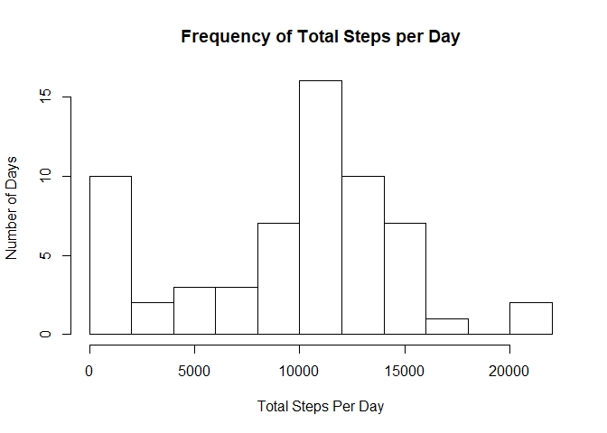
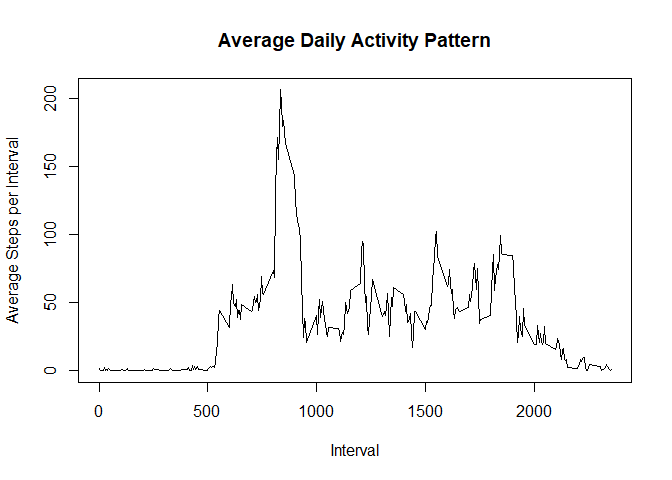
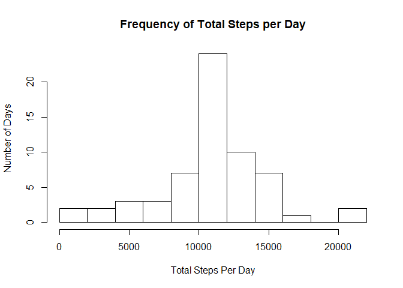

## Loading and preprocessing the data

We will use the dplyr package and the lattice package:

```r
library(dplyr)
library(lattice)
```

Load the data:

```r
dataAct <- read.csv("activity.csv")
```

Convert the date column into date format:

```r
dataAct[,2] <- as.Date(as.character(dataAct[,2]))
```

## What is mean total number of steps taken per day?

1. Calculate the total number of steps taken per day

```r
actGroup <- group_by(dataAct, date)
sumStep <- summarise(actGroup,sum(steps, na.rm = T))
```

2. Make a histogram of the total number of steps taken each day

```r
names(sumStep) <- c("date","sumStep")
hist(sumStep$sumStep, xlab = "Total Steps Per Day", ylab = "Number of Days", breaks = 10,
     main = "Frequency of Total Steps per Day")
```

<!-- -->

3. Calculate and report the mean and median of the total number of steps taken per day

```r
meanStep <- mean(sumStep$sumStep, na.rm = T)
medianStep <- median(sumStep$sumStep, na.rm = T)
```
The **mean** total number of steps taken per day is 9354.2295082 steps.
The **median** total number of steps taken per day is 10395 steps.


## What is the average daily activity pattern?

1. Make a time series plot (i.e. \color{red}{\verb|type = "l"|}type="l") of the 5-minute interval (x-axis) and the average number of steps taken, averaged across all days (y-axis)

```r
interGroup <- group_by(dataAct, interval)
meanStepInter <- summarise(interGroup, mean(steps, na.rm = T))
names(meanStepInter) <- c("interval","meanStep")
plot(x=meanStepInter$interval, y=meanStepInter$meanStep,
     type = "l",xlab = "Interval", ylab = "Average Steps per Interval", main = "Average Daily Activity Pattern")
```

<!-- -->

2. Which 5-minute interval, on average across all the days in the dataset, contains the maximum number of steps?

```r
maxInterval <- subset(meanStepInter, meanStepInter$meanStep == max(meanStepInter$meanStep))$interval
```

The 5-minute interval which contains the maximum number of steps is 835


## Imputing missing values

1. Calculate and report the total number of missing values in the dataset (i.e. the total number of rows with \color{red}{\verb|NA|}NAs)

```r
nbeNA <- sum(!complete.cases(dataAct))
```
The number of missing values in the dataset is 2304.

2. Devise a strategy for filling in all of the missing values in the dataset. The strategy does not need to be sophisticated. For example, you could use the mean/median for that day, or the mean for that 5-minute interval, etc.

The mean for the 5-minute interval across the other days seems the right choice. Then, we will fill the missiing values with this.

3. Create a new dataset that is equal to the original dataset but with the missing data filled in


```r
nbeNA <- sum(!complete.cases(dataAct))
dataActFill <- dataAct
dataActFill<-group_by(dataActFill, interval)
dataActFill <- mutate(dataActFill, mean = mean(steps, na.rm = T))
dataActFill$steps <- ifelse(is.na(dataActFill$steps), dataActFill$mean, dataActFill$steps)
actGroupFill <- group_by(dataActFill, date)
sumStepFill <- summarise(actGroupFill,sum(steps))
```

4. Make a histogram of the total number of steps taken each day and Calculate and report the mean and median total number of steps taken per day. Do these values differ from the estimates from the first part of the assignment? What is the impact of imputing missing data on the estimates of the total daily number of steps?

```r
names(sumStepFill) <- c("date","sumStep")
hist(sumStepFill$sumStep, xlab = "Total Steps Per Day", ylab = "Number of Days", breaks = 10,
     main = "Frequency of Total Steps per Day")
```

<!-- -->

```r
meanStepFill <- mean(sumStepFill$sumStep)
medianStepFill <- median(sumStepFill$sumStep)
```
The **mean** total number of steps taken per day is 1.0766189\times 10^{4} steps.
The **median** total number of steps taken per day is 1.0766189\times 10^{4} steps.

The two values are now the same. It makes sense since the median value move closer to the mean when filling the missing values.

## Are there differences in activity patterns between weekdays and weekends?

1. Create a new factor variable in the dataset with two levels – “weekday” and “weekend” indicating whether a given date is a weekday or weekend day

```r
dataActFill$dayType <- as.numeric(format(dataActFill$date, format = "%u"))
dataActFill$dayType <- ifelse(dataActFill$dayType==6|dataActFill$dayType==7, "weekend", "weekday")
dataActFill <- select(dataActFill,-mean)
```

2. Make a panel plot containing a time series plot (i.e. \color{red}{\verb|type = "l"|}type="l") of the 5-minute interval (x-axis) and the average number of steps taken, averaged across all weekday days or weekend days (y-axis).


```r
intervalGroup <- group_by(dataActFill, interval, dayType)
meanStepInterval <- summarise(intervalGroup, mean(steps, na.rm = T))
names(meanStepInterval)[3] = "meanStep"
xyplot(meanStep ~ interval | dayType, data = meanStepInterval,
       type = 'l',
       xlab = 'Interval',
       ylab = 'Number of Steps',
       layout = c(1,2))
```

<!-- -->
